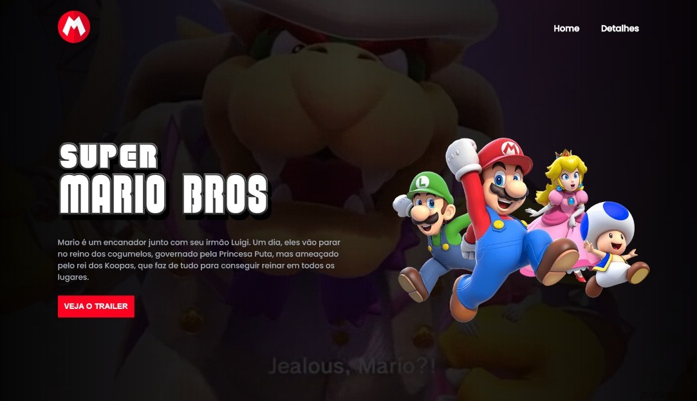

<h1 align="center"> Mario Page Trailer </h1>

  <a href="#-tecnologias">Tecnologias</a>&nbsp;&nbsp;&nbsp;|&nbsp;&nbsp;&nbsp;
  <a href="#-projeto">Projeto</a>&nbsp;&nbsp;&nbsp;|&nbsp;&nbsp;&nbsp;
  <a href="#memo-licença">Licença</a>

  

 

  

## 🚀 Tecnologias

Esse projeto foi desenvolvido com as seguintes tecnologias:

- HTML e CSS
- JavaScript
- Git e Github

## 💻 Projeto

O Projeto Mario Page Trailer é uma página de apresentação da sinopse do filme "Super Mario Bros - O Filme" com um modal do vídeo no Youtube o que leva o usuário a conhecer um pouco mais sobre o filme.

 - [Visite o projeto online](https://luishdev.github.io/Projeto-Mario-Page-Trailer/)

## :memo: Licença

Esse projeto está sob a licença MIT.

---

Feito com ♥ by LuisHdev and DevEmDobro :wave: [Participe da comunidade!](https://devemdobro.com/comunidade-dev-em-dobro/)
